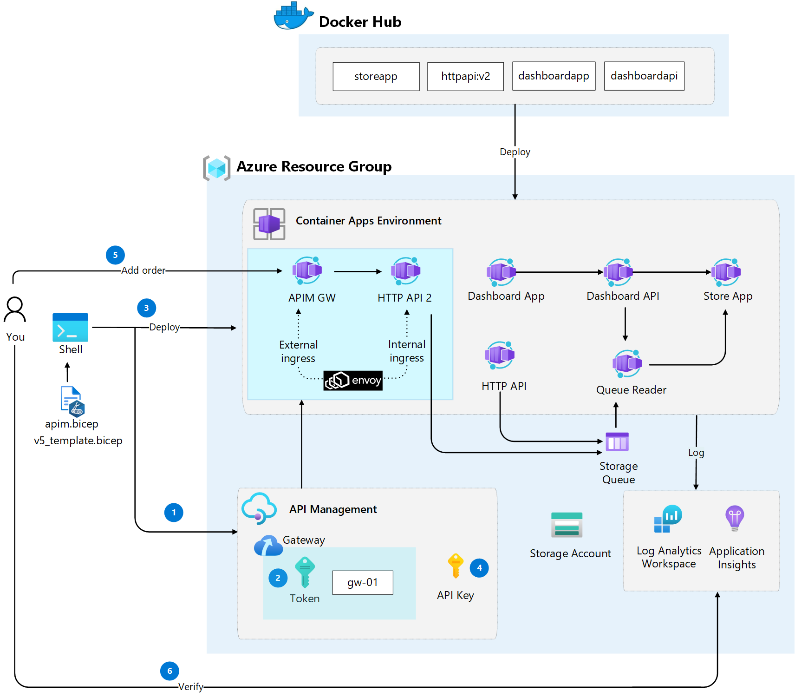

# Challenge 6: Configure CI/CD for Container Apps
The self-hosted gateway is an optional, containerized version of the default managed gateway included in every API Management service. It's useful for scenarios such as placing gateways in the same environments where you host your APIs. Use the self-hosted gateway to improve API traffic flow and address API security and compliance requirements.

Now it's time to deploy our _HTTP API_ behind _API Management self hosted gateway_ to protect it from direct internet access.

> **Note** 
> The API Management creation in this challenge takes about 30-45 minutes to complete. Plan accordingly and perhaps start the deployment before a break.

The following image illustrates the steps in this challenge

## Main objectives
- Create an API Management service with self hosted gateway
- Deploy self hosted gateway as Container App
- Configure internal ingress for _HTTP API_
- Expose an internal HTTP API operation via the self hosted gatway
- Verify changes after deployment

## Activities

- Create an API Management service with self hosted gateway. Grab the Gateway token from the provisioned SHGW.
- Create a new Container App _httpapi2_ based on the same image used in previous challenge.
- Configure an internal ingress for _httpapi2_ Container App. 
- Create a new Container App _apim_ based on an image provided by Microsoft.
- Configure an external ingress for _apim_ Container App.
- Configure an API, operation in API Management and expose the API inside the SHGW.

## Definition of done
- Created an API Management service with self hosted gateway using existing [Bicep apim template](apim.bicep)
- Deployed [Bicep template v5](v5_template.bicep) which includes a new _HTTP API 2_ app
- Added a new order by doing a _HTTP POST_ to HttpAPI (https://httpapi.[your container app environment domain]/data?message=[your message]) with a APIM key in the header (_X-API-key_) 
- Verified logs in Log Analytics for QueueReader application that the QueueReader App is logging with your order message.
 

## Helpful links
- [API Management self-hosted gateway overview (learn.microsoft.com)](https://docs.microsoft.com/en-us/azure/api-management/self-hosted-gateway-overview)
- [curl manual (curl.se)](https://curl.se/docs/manual.html)
- [Invoke-RestMethod (learn.microsoft.com)](https://learn.microsoft.com/en-us/powershell/module/microsoft.powershell.utility/invoke-restmethod?view=powershell-7.2)
- [Monitor logs in Azure Container Apps with Log Analytics (learn.microsoft.com)](https://learn.microsoft.com/en-us/azure/container-apps/log-monitoring?tabs=bash)

## Solution
- View the solution here: [Challenge 6 - Solution](solution6.md)

## The challenges

- [Challenge 1: Setup the environment](challenge1.md)
- [Challenge 2: Deploy Container Apps Environment and troubleshoot Container Apps](challenge2.md)
- [Challenge 3: Split traffic for controlled rollout](challenge3.md)
- [Challenge 4: Scale Container Apps](challenge4.md)
- [Challenge 5: Configure CI/CD for Container Apps](challenge5.md)
- [Challenge 6: Protect Container App with API Management](challenge6.md)
- [Challenge 7: Enable Container App authentication](challenge7.md)

